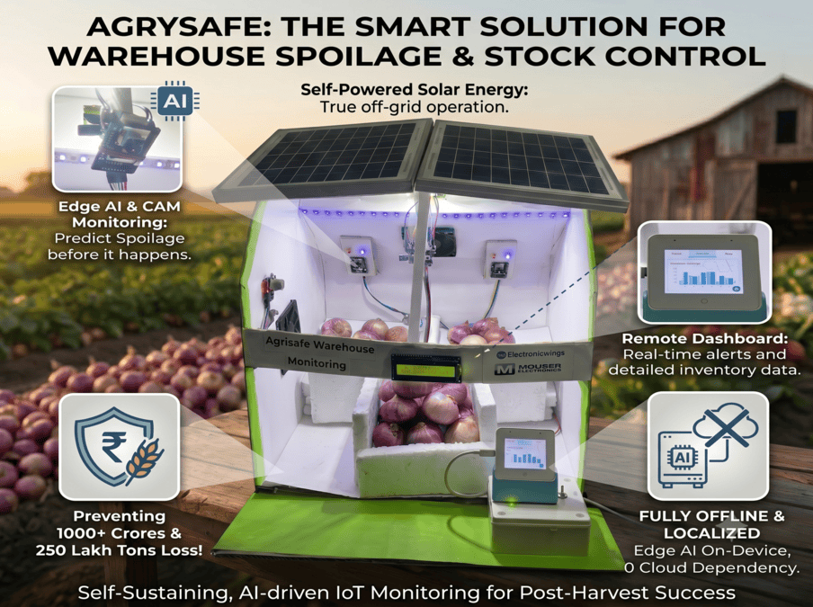
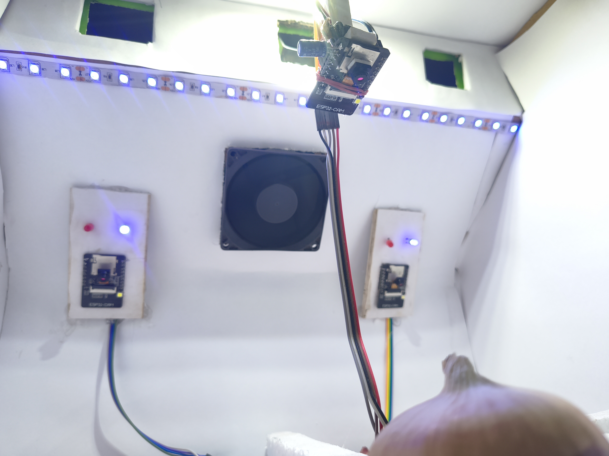
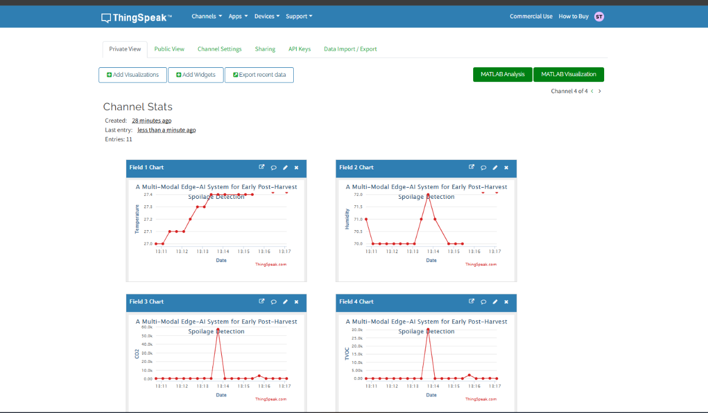

# 🌾 AgriSafe Rot-Spotter

### A Multi-Modal Edge-AI System for Early Post-Harvest Spoilage Detection

<p align="center">
  


<p align="center">
  

<p align="center">


## 📌 Overview

Every year, a significant portion of agricultural produce is lost after harvest due to undetected spoilage during storage and transportation. Traditional monitoring systems rely primarily on temperature and humidity measurements, which are often insufficient for detecting the early stages of biological decay.

**AgriSafe Rot-Spotter** is a Multi-Modal Edge-AI platform designed to detect spoilage before visible symptoms appear by combining:

* 🧠 Edge AI
* 📷 Computer Vision
* 🌡️ Environmental Monitoring
* 🧪 VOC & CO₂ Gas Analysis
* 📡 ESP-NOW Wireless Communication
* ☁️ ThingSpeak Cloud Analytics
* ☀️ Solar-Powered Operation

The system continuously monitors produce storage chambers and provides early warnings, enabling farmers and warehouse operators to take corrective action before large-scale losses occur.

---

# 🚨 The Problem

India loses agricultural produce worth more than **₹1.5 lakh crore annually** due to post-harvest losses. Onions and tomatoes alone contribute thousands of crores of rupees in losses every year. Spoilage is often detected only after visible symptoms appear, by which time the damage has already spread.

Traditional systems suffer from:

❌ Manual inspection

❌ Late spoilage detection

❌ No gas monitoring

❌ No predictive capability

❌ Dependence on cloud connectivity

---

# 💡 Our Solution

AgriSafe Rot-Spotter combines multiple sensing modalities to create a robust spoilage detection system.

### Sensor Fusion Approach

| Technology       | Purpose                           |
| ---------------- | --------------------------------- |
| ESP32-CAM        | Visual spoilage detection         |
| SGP30 VOC Sensor | Detect decomposition gases        |
| CO₂ Monitoring   | Identify microbial activity       |
| DHT11            | Temperature & humidity monitoring |
| Edge AI          | Local classification              |
| ESP-NOW          | Low-latency communication         |
| ThingSpeak       | Cloud dashboard & analytics       |

Unlike conventional systems, AgriSafe performs processing locally at the edge, allowing operation even in rural environments with limited internet connectivity.

---

# 🏗 System Architecture

```text
Storage Chamber Nodes
│
├── ESP32-CAM
├── SGP30 VOC Sensor
├── DHT11 Sensor
│
└── Edge AI Processing
        │
        ▼
ESP-NOW Communication
        │
        ▼
ESP32-S3-BOX-3 Dashboard
        │
 ┌──────┴──────┐
 │             │
 ▼             ▼
Voice Alerts   ThingSpeak Cloud
               Analytics Dashboard
```

---

# ✨ Key Features

✅ Early VOC-based spoilage detection

✅ Multi-modal sensor fusion

✅ Offline Edge-AI inference

✅ ESP-NOW wireless communication

✅ Real-time dashboard visualization

✅ Touchscreen interface

✅ Voice and buzzer alerts

✅ ThingSpeak cloud monitoring

✅ Solar-powered deployment

✅ Multi-chamber scalability

---

# 📊 ThingSpeak Cloud Analytics

The system integrates ThingSpeak for:

* Real-time remote monitoring
* Historical trend analysis
* Environmental condition tracking
* Predictive maintenance insights
* Multi-chamber health visualization
* Long-term data storage

This enables storage management to transition from reactive inspection to proactive intervention.

---

# 🔬 Why Multi-Modal AI?

Research indicates that combining visual information with environmental and gas sensor data provides significantly higher spoilage detection accuracy than using a single sensing modality. Multi-modal AI systems can detect spoilage indicators earlier and more reliably than traditional monitoring approaches.

---

# 📈 Potential Impact

Even a modest **5% reduction in spoilage** can potentially save:

* 🧅 13+ lakh tonnes of onions annually
* 💰 Thousands of crores of rupees
* 🌱 Significant reductions in food waste
* 👨‍🌾 Increased farmer profitability

AgriSafe aims to transform warehouses from passive storage facilities into intelligent predictive environments.

---

# 🛠 Hardware Components

### Core Processing

* ESP32-S3-BOX-3
* ESP32-CAM Modules
* ESP8266 Wi-Fi Module

### Sensors

* SGP30 VOC & eCO₂ Sensors
* DHT11 Temperature & Humidity Sensors

### Actuation

* Cooling Fans
* Relay Driver Modules
* Buzzer Alerts
* LCD Dashboard

### Power System

* Solar Panel
* Waveshare Solar Power Manager (MPPT)
* 18650 Li-Ion Batteries
* LM2596 Buck Converters

---

📊 Results & Performance

MetricValueEarly detection window2–3 days before visible rotVision classification accuracy~91% (test set)VOC detection response time< 2 secondsEnd-to-end alert latency< 5 seconds from VOC spike to hub alertPower consumption (per node)~180mA active / ~12mA sleepWireless range (ESP-NOW)Up to 200m line-of-sightInternet dependencyZero — fully offline


💰 Impact & Economics

ParameterValueIndia's annual onion production269 lakh tonnesPost-harvest spoilage rate10–12%Annual loss — onions alone₹11,000+ croreAnnual loss — all produce (India)₹1.5 lakh croreEstimated BOM cost per node< ₹800Target deploymentRural cold storage, mandis, cooperative warehouses

A conservative 5% reduction in spoilage saves an estimated 13+ lakh tonnes of onions annually — directly increasing net income for small and marginal farmers.


🔭 Future Scope


 VOC Trend Prediction — Time-series modeling of VOC curves for 12–24hr predictive alerts before threshold breach
 Captive Portal Dashboard — Local Wi-Fi AP + browser dashboard, no app install needed
 Offline Voice Commands — Wake-word detection via ESP-SR ("Hey AgriSafe, status Chamber 2")
 Multi-Produce Models — Retrain Edge Impulse model for tomatoes, potatoes, grain sacks
 LoRa Backhaul — Long-range telemetry for large warehouse clusters spanning multiple sheds
 FSSAI Data Integration — Log spoilage events to a local SD card for compliance reporting
---

# 🏆 Achievements

* Selected among Top Finalists in the CircuitDigest Smart Home & Wearables Project Contest
* Demonstrates practical deployment of Edge AI in Agriculture
* Designed for low-cost rural adoption
* Supports sustainable and solar-powered farming infrastructure

---

# 📚 Project Article

Read the complete project article:

🔗 https://circuitdigest.com/microcontroller-projects/agrisafe-rot-spotter-a-multi-modal-edge-ai-system-for-early-post-harvest-spoilage-detection

---

# 👨‍💻 Author

**Shreerama T D**

Electronics & Communication Engineering

Embedded Systems | IoT | Edge AI | Robotics

---

## 🌱 "Saving food is easier than growing more."

AgriSafe Rot-Spotter focuses on preventing losses before they occur, helping farmers protect their harvest, income, and future.
